# DAT Brief 6
[présentation](https://hackmd.io/p/eYNLlBf6R9iAoI-p6g2iYA)
## architechture

```mermaid
flowchart LR
subgraph kuber [cluster kubernetes]
ippub[ip publique]---AG---n1 & n2 & n3 & n4
subgraph VMSS
n1[node 1]
n2[node 2]
n3[node 3]
n4[node 4]
end
subgraph K8s
kublet-.-clstipvt & pod1 & pod2 & pod3 & ingress & strcl & clstiprd & scrmdp & scrcert
clstipvt[cluster IP\nvote]
pod1[redis]
pod2[vote]
pod3[...]
ingress
strcl[storage\nclass]
clstiprd[clusterip\nredis]
scrmdp["secret mdp \n redis"]
scrcert[secret\ncertificat SSL]
end
AG-.-ingress---clstipvt---pod2 & pod3
clstiprd---pod1
clstiprd---clstipvt
pod1--persistant_storage---strcl---DD
pod1 & pod2 & pod3 -..- VMSS
end
 classDef null fill:#000,width: 1;
```

## Objectifs
 utiliser kubernetes et azure pour déployer une application de vote, une base de donnée redis, un stockage persistant pour la abse de donnée. l'application de vote doit être disponible via notre zone DNS en passant par une application gateway connecter à kubernetes avec un ingress.
 
## listes des éléments déployé avec kubernetes

- Secrets
    - mot de passe pour redis
    - certificat TLS
    - clé privée TLS
- storage
    - storageclass
        - azure disk
    - PersistentVolumeClaim
        - 8Gi
        - read write once
- redis
    - deployment redis
        - replicas: 1
        - volume
        - port 6379
        - env:
            - REDIS_PWD
            - ALLOW_EMPTY_PASSWORD:no
    - clusterIP redis
        - port: 6379
- ingress
    - ingress azure application gateway
        - tls
        - azure apllication gateway
- voting app
    - deployment voteapp
        - replicas: 2
        - port: 80
        - resources:
            - request, cpu: 250m
            - limits, cpu: 500m
        - env:
            - REDIS
            - STRESS-SECS: 2
            - REDIS_PWD
    - clusterIP voteapp
        - port 80
    - HorizontalPodAutoscaler
        - max replicas: 8
        - min replicas: 2
        - scale target ref: voteapp
        - CPU utilisation %: 70
## zone DNS
[rajaxpression.distributeur-de-pain.best](https://rajaxpression.distributeur-de-pain.best/)

## éléments déployés sur azure

- azure kubernetes service
    - 4 nodes
    - ingress application gateway
    
